<table align="center"><tr><td align="center" width="9999"><br>


# Unidade Curricular:  Projeto Integrador 3 

<b>Instituto Federal de Educação, Ciência e Tecnologia de Santa Catarina<br>
Campus Florianópolis<br></b>
**Professor:**  Robinson Pizzio e Matheus Leitzke Pinto<br>
**Alunos:**  Alexsander Vieira e Jonathan Chrysostomo Cabral Bonette<br>
</td></tr></table>

* [1. Introdução](#1-introdução)
* [2. Requisitos](#2-requisitos)
* [3. Lista de Componentes](#3-lista-de-componentes)
* [4. Configuração do Software](#4-configuração-do-software)
* [5. Montagem do Hardware](#5-montagem-do-hardware)
* [6. Funcionalidades Implementadas](#6-funcionalidades-implementadas)
* [7. Testes, Desafios e Aprendizados](#7-testes-desafios-e-aprendizados)
* [8. Próximos Passos e Melhorias Futuras](#8-próximos-passos-e-melhorias-futuras)
* [9. Conclusão](#9-conclusão)
* [10. Referências](#10-referências)

## 1. Introdução

### Objetivo do Projeto
O Espelho Inteligente é um projeto inovador que combina tecnologia e praticidade, transformando um espelho comum em uma interface inteligente e interativa. O propósito do projeto é integrar informações úteis e personalizadas diretamente na superfície do espelho, permitindo ao usuário acessar uma variedade de serviços enquanto realiza suas atividades cotidianas, como se arrumar para o dia ou se preparar para dormir.

Este projeto foi desenvolvido com foco em automação residencial, personalização e aprendizado prático com dispositivos como o Raspberry Pi. A ideia central é proporcionar uma experiência de usuário que seja funcional e informativa, tornando as rotinas diárias mais eficientes e conectadas. Além disso, o desenvolvimento do Espelho Inteligente oferece uma oportunidade única para explorar e aplicar conhecimentos de programação, eletrônica e design de interfaces.

### Descrição Geral

O Espelho Inteligente é uma interface digital refletiva composta por componentes como um monitor, um Raspberry Pi, uma película reflexiva, sensores e uma moldura de madeira. Ele funciona como um "dashboard" que exibe informações variadas, como hora, calendário, previsão do tempo, notícias, e até notificações personalizadas. A integração de módulos configuráveis permite que o espelho seja altamente personalizável, adaptando-se às necessidades e preferências de cada usuário.

## 2. Requisitos

### Requisitos Funcionais
O Espelho Inteligente deve ser capaz de funcionar tanto como um espelho tradicional quanto como um dispositivo inteligente. Para isso, ele deve:

**Exibir informações essenciais:** Mostrar hora, data, previsão do tempo, notícias, agenda do dia e outros dados úteis na superfície refletora.<br>
**Controlar por sensor de movimento:** Alternar entre o modo espelho e o modo inteligente ao detectar a presença do usuário.<br>
**Personalização de módulos:** Permitir a configuração e personalização dos módulos de exibição para que o usuário escolha quais informações deseja visualizar.<br>
**Notificações:** Apresentar notificações de eventos importantes, como lembretes, e-mails ou mensagens de redes sociais, caso configurado.<br>

### Requisitos Não Necessáriamente Aplicáveis
**Desempenho:** O Espelho Inteligente deve ser responsivo, com tempos de carregamento mínimos para os módulos exibidos e fluidez na troca de informações, dependerá de API's e módulos de terceiros<br>
**Confiabilidade:** O sistema deve operar de forma contínua e estável, sem falhas ou reinicializações frequentes, dependerá de API's e módulos de terceiros<br>
**Usabilidade:** A interface deve ser simples e intuitiva, de modo que qualquer usuário, independentemente de sua familiaridade com tecnologia, consiga interagir facilmente, caso não configurado<br>
**Segurança:** Deve garantir que dados sensíveis, como notificações pessoais, sejam tratados com privacidade, e que o sistema esteja protegido contra acesso não autorizado, caso não configurado<br>

### Requisitos de Software e Hardware
#### • Hardware:

**Raspberry Pi 4 Model B:** Placa de processamento principal do projeto.<br>
**Monitor:** Para exibição das informações por trás do espelho.<br>
**Película reflexiva:** Aplicada no vidro do espelho para permitir que o monitor exiba informações enquanto mantém a reflexão.<br>
**Moldura de madeira:** Estrutura que acomoda todos os componentes, incluindo o monitor, vidro do espelho, sensor, etc.<br>
**Sensores:** Para detectar a presença do usuário e ativar/desativar outras funcionalidades do espelho.<br>
**Fonte de alimentação:** Para fornecer energia ao Raspberry Pi e outros componentes.

#### • Software:

**Raspberry Pi OS:** Sistema operacional baseado em Linux, utilizado para rodar a Aplicação.<br>
**Framework:** Plataforma modular que permite adicionar, remover e configurar módulos de exibição.<br>
**Bibliotecas de Sensores:** Para integrar sensores, como o sensor de movimento, são utilizadas bibliotecas específicas que permitem a comunicação entre o Raspberry Pi e os dispositivos conectados. Essas bibliotecas fornecem funções prontas para ler dados de sensores, detectar eventos, e acionar ações correspondentes (por exemplo, acender a tela do espelho ao detectar movimento). Elas são escritas em linguagens como Python ou JavaScript, dependendo do sensor e da necessidade de integração com o espelho.<br>
**Electron:**  Um framework que permite criar aplicações de desktop utilizando tecnologias web como HTML, CSS e JavaScript. O Electron é utilizado para executar a aplicação em um ambiente de desktop no Raspberry Pi, transformando o código web em uma aplicação executável. Isso facilita a integração com o hardware do Raspberry Pi e permite que a interface seja exibida de maneira otimizada em tela cheia.<br>
**Node.js:** Um ambiente de execução JavaScript que roda no servidor e é usado para gerenciar a lógica da interface e dos módulos. O Node.js facilita a comunicação entre o espelho e os serviços externos, como APIs de notícias e previsão do tempo, além de gerenciar as interações do usuário com os módulos do espelho.<br>
**Bibliotecas Adicionais:** Diversas bibliotecas de JavaScript e Node.js são utilizadas para funcionalidades específicas, como manipulação de data e hora, comunicação com serviços de terceiros (ex.: APIs de previsão do tempo e notícias), e controle de exibição de informações. Algumas dessas bibliotecas são essenciais para o funcionamento dos módulos do projeto e garantem que os dados sejam apresentados de forma dinâmica e atualizada.<br>
**Módulos Personalizados:** Scripts e aplicações adicionais para funcionalidades específicas (ex.: scripts para controle de sensor de movimento).<br>

## 3. Lista de Componentes

### Componentes de Hardware Utilizados

| Componente | Descrição | Imagem | Custo Aproximado |
|------------|-----------|--------|------------------|
| **Raspberry Pi 4 Model B** |- O "cérebro" do projeto Espelho Inteligente, responsável por executar o sistema operacional e o software do projeto, gerenciando todas as funcionalidades.<br> - Conectividade Wi-Fi integrada<br>- Saída de vídeo HDMI integrada<br>- Capacidades de comunicação IO<br>- Sistema operacional: Raspberry Pi OS |  | R$ 580,00 |
| **Monitor Dell de 27" - P2722H** | - Utilizado como tela do espelho, exibe todas as informações do projeto, como clima, notícias e outras funcionalidades configuradas.<br>- Resolução de 1920 x 1080 a 60 Hz<br>- Entrada de vídeo HDMI integrada<br>- Escolhido pela disponibilidade, deve ser revisado em um produto final para reduzir custos | 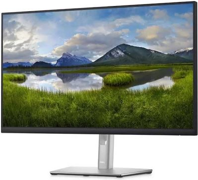 | R$ 1399,00 |
| **Moldura de Madeira** | - Estrutura de suporte e fixação para o conjunto<br>- Adaptada às dimensões do monitor e vidro |  | R$ 50,00 |
| **Vidro para Espelho Inteligente** | - Dimensão ajustada para cobrir a tela do monitor<br>- Espessura específica para garantir resistência e efeito de espelho | 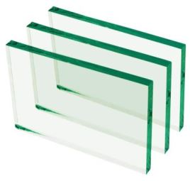 | R$ 25,00 |
| **Película Reflectiva (50x100 cm)** | - Cria o efeito espelhado quando a tela não está ligada<br>- Essencial para transformar o monitor em um espelho interativo |  | R$ 16,91 |
| **Sensor de Gestos GY-PAJ7620U2** | - Detecta movimentos das mãos para controle sem toque<br>- Escolhido após testes com outros sensores | 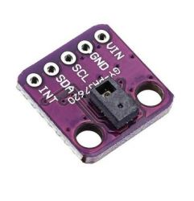 | R$ 27,00 |
| **JBL (Caixa de Som)** | - Utilizada para saída de áudio dos módulos interativos<br>- Aumenta a interatividade e imersão do usuário | 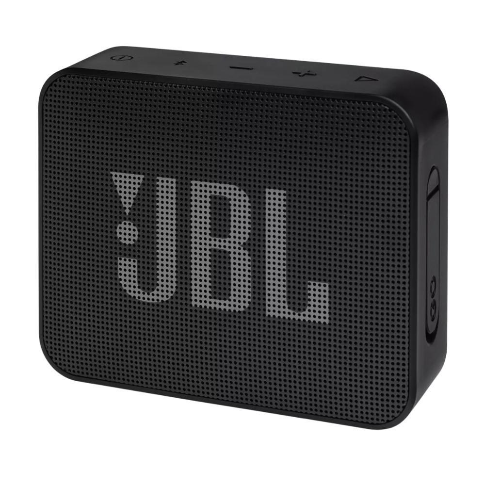 | R$ 165,00 |

### Componentes de Hardware Considerados (Não Utilizados)

| Componente | Descrição | Imagem | Motivo de Descarte | Custo Aproximado |
|------------|-----------|--------|--------------------|------------------|
| **Moldura Touch Screen** | - Facilitaria a interação direta com o espelho através de toques<br>- Permite um controle intuitivo do sistema |  | Alto custo e complexidade na instalação e integração com o sistema | R$ 500,00 |
| **Sensor PIR** | - Utilizado para detectar presença humana e ajustar o brilho da tela ou ligar/desligar automaticamente<br>- Poderia aumentar a economia de energia<<br> - Poderíamos tirar a função de detecção do sensor de gestos | 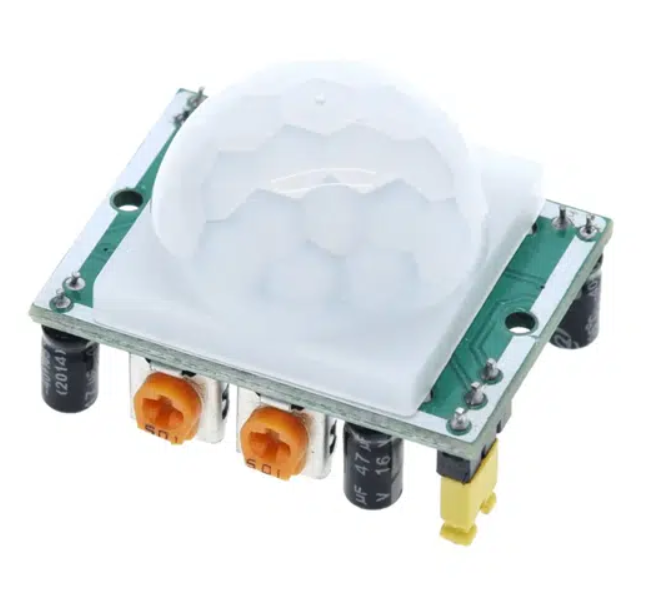 | Tempo de implementação | R$ 30,00 |
| **LEDs para Iluminação** | - LEDs integrados ao redor da moldura para iluminação adicional<br>- Poderia fornecer luz ambiente ou notificações visuais | 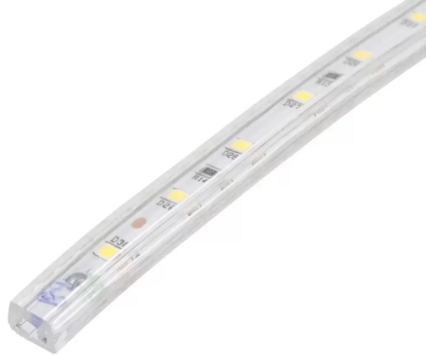 | Custo de instalação e necessidade de integração com o sistema | R$ 30,00 |
| **Acrílico Especial para Reflexão** | - Acrílico com transparência e reflexividade específicas para melhor efeito de espelho<br>- Alternativa ao vidro comum para maior leveza, resistência e visibilidade. | 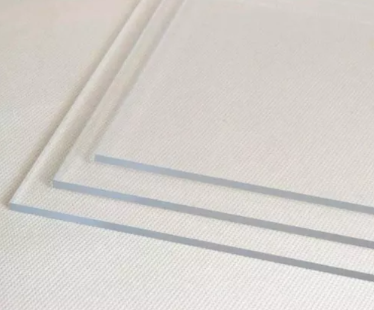 | Difícil de encontrar no mercado local e custo elevado | R$ 350,00 |
| **Raspberry Pi Camera Module** | - Câmera integrada para reconhecimento facial ou videoconferência<br>- Poderia ser usada para segurança ou interação avançada e interação com perfil e detecção do cliente. | 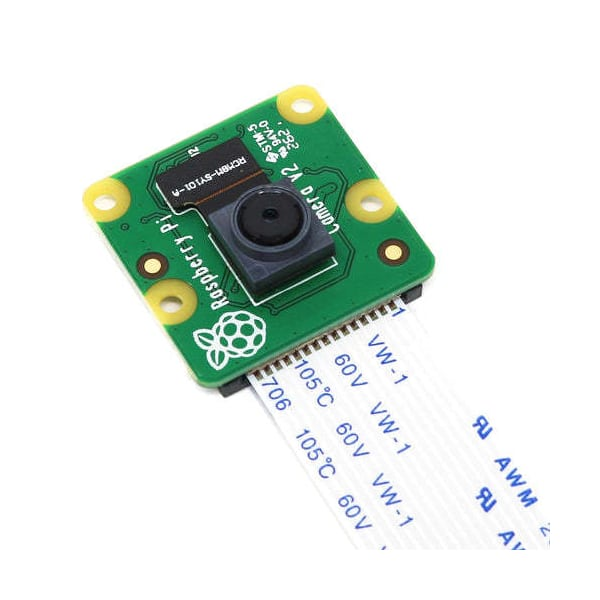 | Complexidade na implementação e preço elevado | R$ 250,00 |
| **Sensor de Temperatura e Umidade DHT** | - Permite medir e exibir a temperatura e umidade interna<br>- Integração com módulos de clima para uma experiência personalizada | 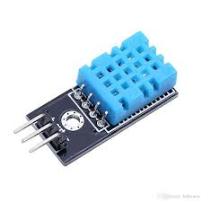 | Tempo necessário para integração | R$ 20,00 |

### Ferramentas Utilizadas

| Ferramenta | Descrição |
|------------|-----------|
| **Chave de Fenda e Martelo** | Utilizadas para montagem e fixação da moldura de madeira |
| **Cola de Madeira e Fita Isolante** | Para acabamento e segurança das conexões |
| **Serra Manual/Elétrica** | Necessária para cortar a madeira nas dimensões corretas |
| **Papel de Acabamento e Lixa** | Para dar acabamento estético e suavizar a madeira |
| **Pregos e Parafusos** | Para fixação da estrutura e montagem final |

## 4. Configuração do Software

### Instalação do Sistema Operacional
Para começar, precisamos instalar o sistema operacional no Raspberry Pi. Neste projeto, vamos utilizar o Raspberry Pi OS, uma versão otimizada de Linux. O processo é simples:

**1.** Baixar a última versão do Raspberry Pi OS do site oficial.<br>
**2.** Usar um o próprio software do Raspberry Pi para gravar a imagem do sistema operacional em um cartão microSD.<br>
**3.** Inserir o cartão microSD no Raspberry Pi e conectar o dispositivo ao monitor, teclado e mouse.<br>
**4.** Ligar o Raspberry Pi e seguir as instruções na tela para configurar o sistema operacional, incluindo a conexão à internet.<br>

### Configuração da Aplicação
Após o sistema operacional estar pronto, vamos instalar a base do projeto:

**1.** Certificar de que o Node.js está instalado. Para isso, abrir o terminal no Raspberry Pi e instalar a versão mais recente do Node.js conforme as instruções da documentação oficial.<br>
**2.** Verificar se o Git está instalado digitando git no terminal. Se não estiver, instalar com o comando **sudo apt-get install git**.<br>
**3.** Clonar o repositório do projeto base com o comando:

 ```sh
git clone https://github.com/MichMich/MagicMirror
 ```

**4.** Entrar na pasta do projeto:

 ```sh
cd MagicMirror/
 ```

**5.** Instalar o aplicativo com:

 ```sh
npm install
 ```

**6.** Iniciar o aplicativo com o comando **npm start**.


### Instalação dos Módulos
Com a aplicação funcionando, é hora de personalizar conforme a preferencia.

### Módulos usados:

**Hora, Calendário, Agenda, Tempo, Fórmula 1, Rádio, Notícias, Câmeras de Segurança, Informações do Hardware, Sinal Wi-Fi, Spotify, Youtube, Horário de Onibus e Modulos de Sensores**<br>

A instalação e configuração dos módulos foi uma etapa que exigiu bastante pesquisa e trabalho. Cada módulo tem suas especificidades e desafios, API's e configurações, então foi necessário um mergulho nas documentações para entender como cada um deles funciona e como poderiam ser integrados ao projeto. Em alguns casos, foi preciso ajustar configurações detalhadamente, testar diferentes abordagens e, por vezes, até modificar grande parte dos códigos para alcançar o resultado desejado. Essa parte do processo envolveu bastante tentativas e erros, e um bom tempo dedicado a explorar soluções e encontrar a melhor forma de fazer cada módulo interagir de maneira fluida e eficiente com o sistema. Todo esse esforço foi importante para garantir que oprojeto possa oferecer uma experiência realmente personalizada e integrada, mostrando informações úteis de forma dinâmica e adaptada ao contexto do usuário.<br>

Alguns esforços específicos valem a pena ser mencionados, como é o caso da integração dos sensores de movimento ao projeto, no qual foi um desafio significativo e exigiu um trabalho considerável para alcançar o resultado desejado. O objetivo era utilizar os sensores para permitir a interação com o espelho, como mudar de página ou ativar funcionalidades com movimentos das mãos.

Essa integração envolveu diversas etapas complexas:

### Escolha do Sensor
Inicialmente, foi necessário selecionar o sensor adequado para capturar movimentos de forma precisa. Diversos modelos foram avaliados para encontrar aquele que melhor atendia às necessidades do projeto.

Testamos alguns sensores diferentes antes de finalmente encontrar aquele que melhor atendia às nossas necessidades:

**• APDS-9960:** Este sensor foi uma das primeiras opções testadas. Embora oferecesse boas funcionalidades, como detecção de proximidade e gestos, enfrentamos problemas com a precisão e a distância de detecção. O sensor frequentemente falhava em identificar corretamente os movimentos das mãos na distância desejada, o que comprometia a confiabilidade necessária para a aplicação.

<adicionar foto>

**• GP2Y0A21:** O próximo sensor testado foi o GP2Y0A21, conhecido por sua capacidade de medir distâncias. No entanto, este sensor também teve suas limitações. A principal dificuldade foi com as bibliotecas e a integração com o software, que não suportavam bem o sensor, resultando em desempenho insatisfatório e falta de precisão na detecção.

<adicionar foto>

**• PAJ7620U2:** Finalmente, encontramos o sensor PAJ7620U2, que se mostrou muito mais adequado para nossa aplicação. Esse sensor conseguiu atender aos requisitos de detecção de movimento com maior precisão e confiabilidade, permitindo uma interação fluida com o o projeto. Sua integração foi mais eficiente, e o desempenho foi consistente com o que precisávamos para uma experiência de usuário satisfatória.

<adicionar foto>

Durante essa jornada para encontrar o sensor ideal envolveu uma série de testes e ajustes, mas foi essencial para alcançar a funcionalidade desejada e garantir que o projeto respondesse de maneira precisa e confiável aos movimentos das mãos nas quais queriamos inicialmente.

### Configuração do Hardware
A instalação física e a conexão com o Raspberry Pi também exigiram um esforço considerável.

**Instalação Física e Conexão:** A instalação do sensor e sua conexão com o Raspberry Pi envolveu vários ajustes finos. Cada componente teve que ser cuidadosamente posicionado e conectado aos pinos GPIO do Raspberry Pi. Esse processo exigiu atenção aos detalhes para garantir que todas as conexões estivessem firmes e corretamente configuradas, evitando problemas de comunicação e funcionamento incorreto.

**Ajustes nas Bibliotecas:** Após a instalação física, enfrentamos desafios com as bibliotecas necessárias para operar o sensor. As bibliotecas utilizadas inicialmente não estavam totalmente alinhadas com os requisitos do sensor, o que resultou em comportamento instável e dificuldades na detecção. Foram necessários ajustes e atualizações nas bibliotecas para melhorar a compatibilidade e a performance.

**Consultas e Testes:** Para resolver os problemas encontrados, realizamos diversas consultas em fóruns especializados e documentações técnicas. A interação com a comunidade e a busca por soluções em discussões online foram essenciais para entender as nuances do sensor e encontrar as melhores práticas para sua configuração. Cada solução encontrada foi testada rigorosamente para garantir que o sistema funcionasse de acordo com as expectativas.

Esse processo de configuração foi desafiador e exigiu persistência, mas foi crucial para alcançar a integração bem-sucedida do sensor com o projetp. O esforço envolvido garantiu que o sensor de movimento funcionasse de maneira confiável e que o sistema oferecesse a interação intuitiva desejada.

### Desenvolvimento do Software
O maior desafio foi fazer com que o sensor interagisse de forma eficiente com todos os módulos presentes. Isso envolveu a criação de scripts personalizados para processar os sinais do sensor e traduzi-los em ações específicas, como mudar a página exibida. Muitos testes e ajustes foram necessários para obter a sensibilidade adequada e assegurar que o sistema respondesse de maneira precisa e confiável aos movimentos.

### Integração e Testes
A integração do sensor com os módulos e a adaptação da aplicação para reconhecer e responder aos movimentos das mãos foram tarefas complexas. Diversas abordagens foram testadas, e muitas horas foram dedicadas a depurar e ajustar o comportamento do sistema para garantir uma experiência fluida e intuitiva. Processo de muita tentativa, erro e ajustes.

## 5. Montagem do Hardware

A montagem do hardware envolveu várias etapas para garantir que todos os componentes fossem integrados corretamente e o espelho inteligente funcionasse conforme o esperado.

### Construção da Moldura

A construção da moldura de madeira foi a base para o suporte do monitor e do vidro. A moldura foi cuidadosamente medida para encaixar o monitor de 27", mantendo um espaço adequado para o vidro e a película reflexiva. Utilizamos uma serra para cortar as peças de madeira nas dimensões exatas e, em seguida, fixamos as partes com cola de madeira, pregos e parafusos para garantir estabilidade e durabilidade. Após a montagem, a moldura foi lixada e pintada para um acabamento estético.

#### Moldura - Frente
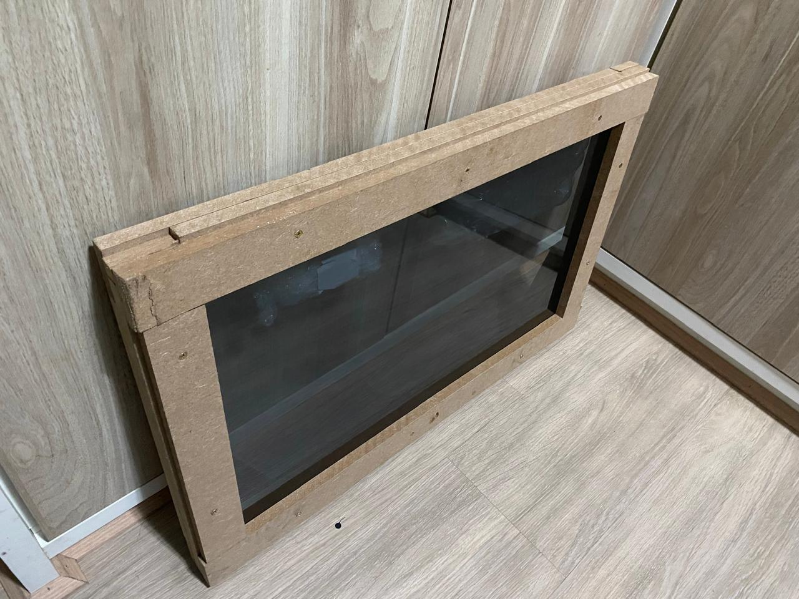

#### Moldura - Traseira
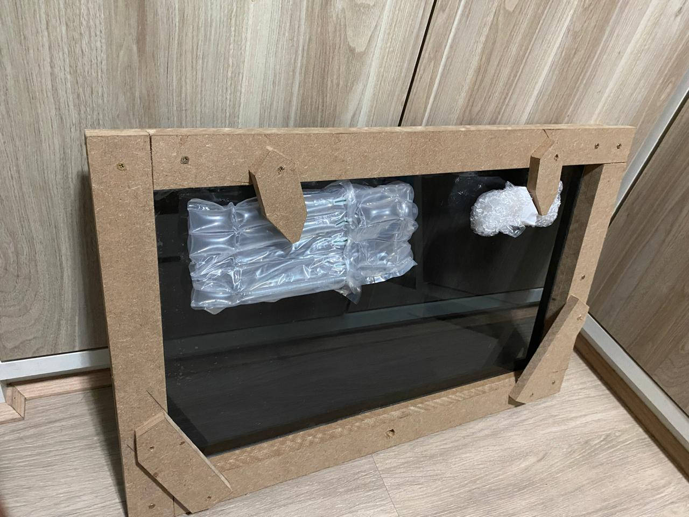

### Instalação do Monitor e Vidro

Após a montagem da moldura, o monitor foi posicionado na parte traseira, fixado com suportes para garantir que ficasse estável e centralizado. Em seguida, o vidro com a película reflexiva foi instalado na parte frontal da moldura. A película foi cuidadosamente aplicada ao vidro para evitar bolhas e garantir um efeito de espelho uniforme quando o monitor estivesse desligado.

#### Vidro com Película - Instalação


### Instalação do Sensor de Movimento

O sensor de movimento GY-PAJ7620U2 foi instalado na parte inferior da moldura, de forma discreta, para detectar gestos das mãos com precisão. A posição foi escolhida para garantir um campo de visão amplo e minimizar interferências, permitindo que o usuário controlasse o espelho inteligente através de gestos sem toque. Várias simulações e testes foram realizados para ajustar a sensibilidade e a área de detecção do sensor.

#### Sensor de Gestos - Instalação


### Conexões e Configurações Finais

Todas as conexões de hardware foram realizadas com o Raspberry Pi 4 Model B, que serve como o "cérebro" do espelho inteligente. Utilizamos cabos HDMI para conectar o monitor, cabos GPIO para integrar o sensor de movimento, e a configuração da alimentação elétrica para garantir que todos os componentes funcionassem de forma sincronizada. Os cabos foram organizados e fixados para manter uma aparência limpa e minimizar interferências ou riscos de curto-circuito.

#### Montagem Final


A montagem final envolveu testes extensivos para garantir que o monitor, o sensor de gestos e todos os outros componentes funcionassem corretamente juntos. Diversas idas a fóruns e ajustes nas bibliotecas foram necessárias para garantir a funcionalidade plena do sistema.

## 6. Funcionalidades Implementadas

O espelho inteligente foi configurado para oferecer diferentes funcionalidades distribuídas em quatro telas distintas, cada uma projetada para atender a necessidades específicas do usuário. A transição entre as telas pode ser feita por gestos, oferecendo uma experiência interativa e moderna.

### Tela 1: Informações Básicas e Boas-Vindas

A **Tela 1** é a interface inicial, projetada para oferecer uma visão geral rápida do dia a dia e saudar o usuário com mensagens amigáveis.

- **Módulo de Hora**: Exibe a hora local em um formato grande e claro, garantindo que seja facilmente visível.
- **Módulo de Calendário Integrado**: Sincronizado com a agenda pessoal, mostra eventos e compromissos futuros, além das condições meteorológicas do dia.
- **Módulo de Cumprimentos**: Uma seleção de mensagens amigáveis e motivacionais, que muda ao longo do dia. De manhã, deseja um "Bom Dia!", à tarde, incentiva a continuar o dia com "Mantenha o foco!" e, à noite, sugere "Descanse bem!"

### Tela 1 - Posição dos Blocos
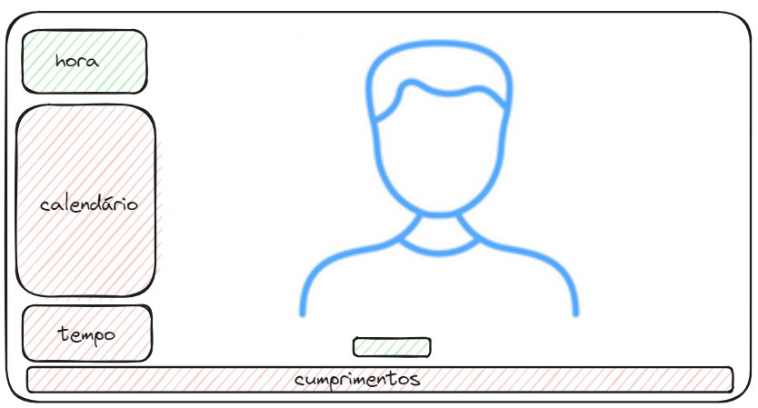

### Tela 1 - Implementação
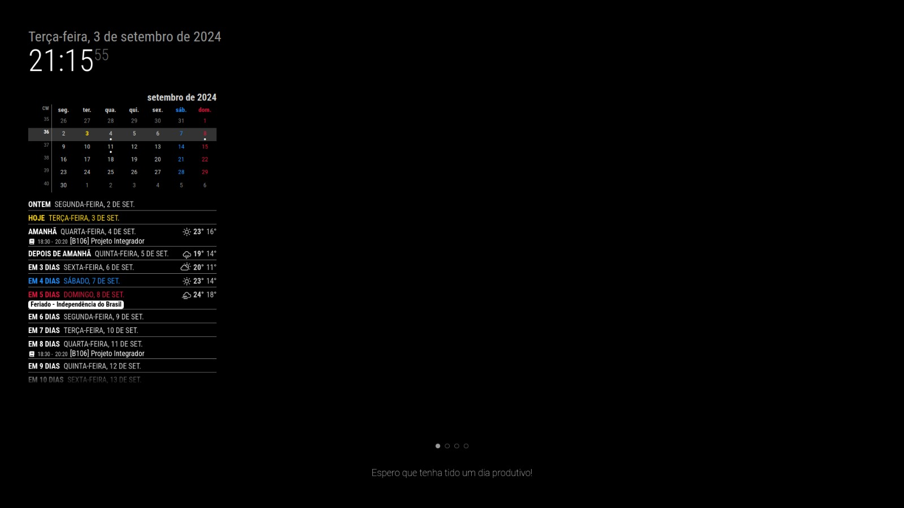

### Tela 2: Entretenimento e Atualizações

A **Tela 2** é voltada para entretenimento e informações esportivas e noticiosas.

- **Módulo de Hora**: Continua presente para garantir que o usuário nunca perca a noção do tempo enquanto se atualiza.
- **Módulo de Fórmula 1**: Mostra a data e hora da próxima corrida, a tabela atualizada do campeonato e a classificação dos pilotos, ideal para os amantes de velocidade.
- **Módulo de Rádio Player**: Inicia a reprodução de uma estação de rádio favorita assim que a tela é ativada, trazendo música ou notícias para acompanhar o dia.
- **Módulo de Notícias**: Traz as últimas notícias de um feed RSS configurado, com atualização automática a cada intervalo de tempo definido. As manchetes rodam constantemente, oferecendo uma visão rápida dos acontecimentos mais importantes.

### Tela 2 - Posição dos Blocos
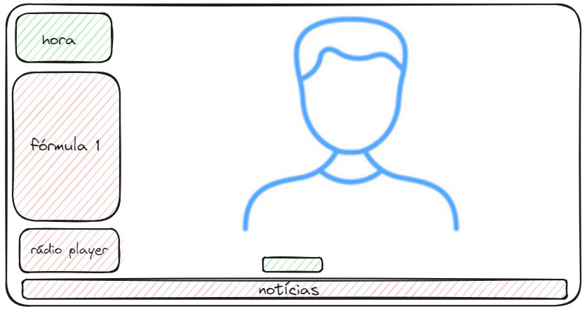

### Tela 2 - Implementação
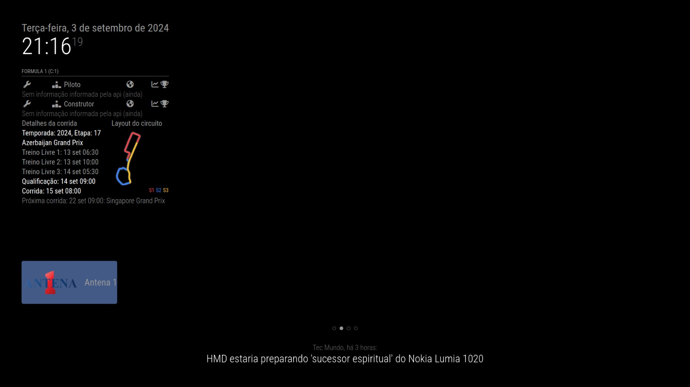

### Tela 3: Segurança e Monitoramento

A **Tela 3** foca na segurança e na performance do sistema, proporcionando ao usuário uma visão em tempo real do ambiente e do hardware.

- **Módulo de Hora**: Acompanhamento contínuo do tempo em todas as telas.
- **Módulo de Câmeras de Segurança**: Exibe imagens ao vivo de três câmeras estrategicamente posicionadas, permitindo monitorar o ambiente de forma discreta.
- **Módulo de Saúde da CPU**: Monitora a temperatura do processador do Raspberry Pi, garantindo que o sistema esteja operando dentro dos parâmetros ideais de temperatura.
- **Módulo de Sinal de Rede Wi-Fi**: Mostra a qualidade e a intensidade do sinal de rede Wi-Fi, útil para entender se há problemas de conexão ou se o espelho está bem conectado.


### Tela 3 - Posição dos Blocos
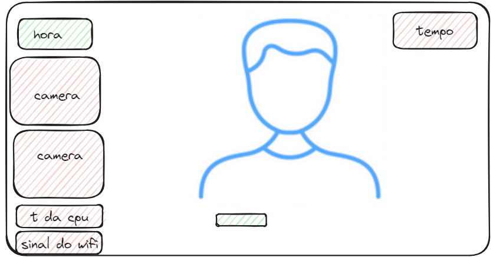

### Tela 3 - Implementação
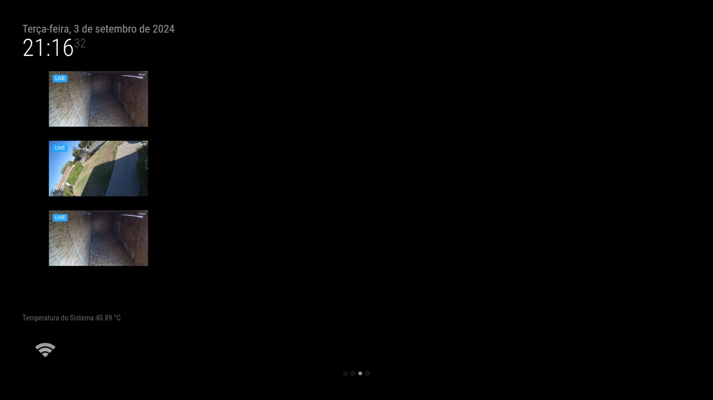

A **Tela 4** é a mais experimental de todas, dedicada a explorar novas possibilidades e integrações com diferentes serviços e aplicativos.

- **Módulo de Hora**: Sempre presente, mantendo a consistência em todas as telas.
- **Módulo de Spotify**: Exibe informações da música que está sendo tocada no dispositivo do usuário, como o celular ou o PC, mostrando capa do álbum, artista e controle de reprodução.
- **Módulo de YouTube**: Permite ao usuário assistir a vídeos diretamente na superfície do espelho, ideal para vídeos curtos ou tutoriais rápidos enquanto se prepara para sair.
- **Módulo de Horários de Ônibus**: Oferece informações em tempo real sobre os próximos horários de saída dos ônibus na região, permitindo ao usuário planejar melhor seus deslocamentos.

### Tela 4 - Implementação dos Protótipos
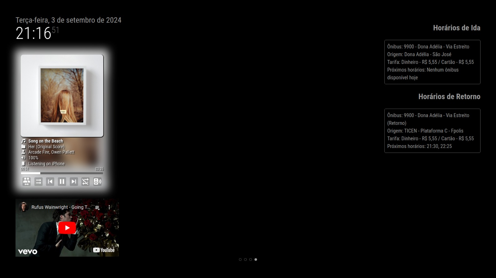

Cada tela foi cuidadosamente projetada para oferecer uma combinação única de funcionalidades que melhoram a vida cotidiana, mantendo o usuário informado, entretido e seguro.

## 7. Testes, Desafios e Aprendizados

### Testes Realizados

Para garantir que o espelho inteligente estivesse funcionando conforme o planejado, realizamos uma série de testes rigorosos envolvendo tanto o hardware quanto o software. A seguir, descrevemos os principais testes realizados:

1. **Teste do Sensor de Movimento**: O sensor de movimento PAJ7620U2 foi um dos componentes mais críticos do projeto, pois seria responsável por permitir a navegação entre as telas do espelho utilizando gestos manuais. Realizamos múltiplos testes de calibração e ajuste, verificando sua capacidade de detecção de movimentos em diferentes distâncias, direções e com variações de iluminação. Testamos também sua precisão em reconhecer os gestos padrão, como acenos e movimentos de mão.

2. **Teste de Conectividade e Rede**: Verificamos a estabilidade da conexão do Raspberry Pi com a rede Wi-Fi para garantir que todos os módulos que dependem da internet (como notícias, rádio, e informações de Fórmula 1) funcionassem corretamente. Realizamos testes de conexão em diferentes partes do local de instalação para medir a intensidade do sinal e assegurar uma conectividade confiável.

3. **Teste de Responsividade do Sistema**: A responsividade do espelho foi testada ao alternar rapidamente entre telas e executar diferentes comandos. Monitoramos o uso da CPU e a temperatura do dispositivo para identificar possíveis gargalos e melhorar o desempenho geral.

4. **Teste de Integração de Módulos**: Cada módulo integrado ao projeto foi testado individualmente e em conjunto, para verificar compatibilidade e assegurar que não houvesse conflitos entre bibliotecas ou erros inesperados durante a execução.

5. **Teste de Interface e Usabilidade**: Avaliamos a usabilidade geral do espelho, observando como o usuário interage com as telas e os módulos. Testamos o fluxo de navegação para garantir que fosse intuitivo, responsivo e fácil de usar.

### Resultados dos Testes

Os testes revelaram uma série de desafios e áreas que precisaram de melhorias:

1. **Documentação Desatualizada e Incompleta**: Um dos maiores desafios foi a falta de documentação adequada e atualizada para alguns módulos e componentes do espelho. Muitas vezes, tivemos que recorrer a fóruns de desenvolvedores e a muita tentativa e erro para descobrir como integrar e configurar certos módulos. Esse processo demandou tempo, mas também trouxe um aprendizado significativo sobre como adaptar e solucionar problemas em projetos de software/hardware aberto.

2. **Calibração de Sensores Chineses**: Os sensores de movimento, especialmente os de fabricação chinesa, apresentaram problemas de calibração e funcionamento instável. Alguns sensores falharam em detectar movimentos de maneira consistente, enquanto outros detectaram gestos incorretamente ou em distâncias inesperadas. Para resolver isso, tivemos que ajustar manualmente as bibliotecas e parâmetros de detecção, além de realizar múltiplos testes práticos até encontrar o sensor e sua configuração ideal.

3. **Configuração do Ambiente no Raspberry Pi**: A preparação do ambiente de desenvolvimento no Raspberry Pi para cada biblioteca e sensor envolveu um esforço considerável. Cada componente exigia uma configuração específica de dependências, e às vezes, atualizações manuais de pacotes, ajustes em arquivos de configuração, ou até recompilação de código. Esse processo, embora desafiador, foi necessário para garantir a compatibilidade entre os diferentes componentes.

4. **Problemas de Conectividade**: Durante os testes de conectividade, percebemos que o espelho tinha dificuldades em se manter conectado em áreas com sinal Wi-Fi fraco. A solução envolveu reposicionar o espelho para uma área com melhor cobertura de sinal e ajustar a configuração da rede para maior estabilidade.

5. **Feedback dos Usuários**: Para garantir a usabilidade do espelho, coletamos feedback de usuários reais (colegas de classe, professores e familiares). As sugestões nos ajudaram a identificar pontos de melhoria, como ajustar o tamanho da fonte de alguns módulos e melhorar a clareza das instruções de navegação.

### Desafios Encontrados

1. **Integração do Sensor de Movimento**: A integração do sensor de movimento PAJ7620U2 foi uma das partes mais complexas do projeto. Passamos por dois sensores antes de chegar ao escolhido, enfrentando problemas de compatibilidade e detecção. O APDS-9960, por exemplo, era bom em teoria, mas falhava na detecção correta e na distância desejada, enquanto o GP2Y0A21 teve limitações de software e não se mostrou confiável.

2. **Documentação e Suporte**: A falta de documentação detalhada e atualizada para muitos componentes e bibliotecas foi um desafio constante. Tínhamos que buscar informações em diversos lugares, como fóruns, comunidades e repositórios de código, e mesmo assim, as respostas nem sempre eram conclusivas. Aprendemos a importância da persistência e de uma abordagem experimental para resolver esses problemas.

3. **Preparação do Ambiente e Configurações**: Configurar o ambiente para cada componente foi um desafio por si só. Alguns sensores e módulos tinham requisitos específicos que exigiam mudanças nos arquivos de configuração do sistema ou até mesmo a recompilação de pacotes. A cada ajuste feito, novos problemas surgiam, o que nos ensinou muito sobre troubleshooting e gerenciamento de dependências.

### Soluções e Aprendizados

1. **Abordagem Iterativa e Testes Constantes**: A realização de testes constantes e uma abordagem iterativa permitiram que identificássemos e corrigíssemos problemas rapidamente. Cada falha era vista como uma oportunidade para ajustar e melhorar o sistema, e essa mentalidade nos ajudou a superar muitos dos desafios técnicos.

2. **Adaptação e Flexibilidade**: A capacidade de adaptar-se às mudanças e às limitações, como a troca de sensores e ajustes de configuração, foi crucial para o sucesso do projeto. Aprendemos a importância de estar sempre preparado para alternativas e de ter um plano de contingência.

3. **Trabalho em Equipe e Colaboração**: A comunicação eficaz e a colaboração constante entre os membros da equipe foram fundamentais. Quando encontrávamos um problema que parecia impossível de resolver, a troca de ideias e o trabalho conjunto levaram as soluções apresentadas.

4. **Aprendizado com a Comunidade**: Participar de fóruns e comunidades online foi essencial para encontrar soluções para problemas que não tinham documentação oficial. Aprendemos o valor de contribuir com essas comunidades, compartilhando nossas descobertas para ajudar outros que possam enfrentar desafios semelhantes.

## 8. Próximos Passos e Melhorias Futuras

Na medida que o projeto do avança, há várias oportunidades para aprimorar a funcionalidade e a experiência do usuário. A seguir, apresentamos algumas das melhorias e expansões que gostaríamos de explorar para levar o projeto a um novo patamar.

### Melhorias Futuras

1. **Integração de Sensores Adicionais**:
   - **Sensor de Movimento PIR**: Adicionar um sensor PIR para aprimorar a detecção de movimento e permitir uma interação mais fluida e responsiva com o projeto. Esse sensor pode ajudar a acionar diferentes funcionalidades conforme a presença do usuário.
   - **Câmera Raspberry Pi**: Incorporar uma câmera Raspberry Pi pode expandir as capacidades do projeto, possibilitando funcionalidades adicionais como monitoramento de segurança e reconhecimento facial.
   - **Sensor DHT**: Incluir um sensor DHT para medir temperatura e umidade com maior precisão, oferecendo uma visão mais detalhada das condições climáticas.

2. **Moldura Touch Screen**:
   - **Exploração de Tecnologia Touch Screen**: Considerar a implementação de uma moldura touch screen para permitir uma interação direta e intuitiva com o projeto. Isso não só moderniza o dispositivo, mas também melhora a experiência do usuário com uma interface mais envolvente.

3. **Refinamento do Design da Interface**:
   - **Aprimoramento Visual e Funcional**: Trabalhar no design da interface para torná-la mais intuitiva e esteticamente agradável. Isso pode incluir a personalização de layouts, melhoria na disposição das informações e ajustes baseados no feedback dos usuários.

### Expansão de Funcionalidades

1. **Integração com Assistentes de Voz**:
   - **Google Assistant e Amazon Alexa**: Incorporar compatibilidade com assistentes de voz para permitir controle por comando vocal. Isso permitirá que o projeto se integre ainda mais com dispositivos inteligentes e torne a interação mais natural e conveniente.

2. **Bot do Telegram**:
   - **Comunicação e Notificações**: Desenvolver um bot do Telegram que possa enviar notificações e permitir interações remotas com o projeto. Essa integração oferece uma nova maneira de interagir com o dispositivo, mesmo quando não se está fisicamente presente.

3. **Novos Módulos**:
   - **Spotify**: Adicionar um módulo para exibir as músicas que estão tocando no Spotify, seja do celular ou do PC, enriquecendo a experiência musical.
   - **YouTube**: Implementar um módulo para assistir vídeos do YouTube diretamente no projeto, proporcionando entretenimento adicional e informações visuais.
   - **Horários de Ônibus**: Melhorar o módulo de horários de ônibus com informações mais detalhadas e uma interface mais amigável, tornando a consulta de horários mais eficiente e fácil de usar.

4. **Aprimoramento do Sensor de Movimento**:
   - **Reconhecimento de Gestos Avançado**: Expandir a funcionalidade do sensor de movimento para reconhecer gestos mais complexos, permitindo uma navegação mais fluida entre diferentes telas e funções.

5. **Otimização do Desempenho**:
   - **Atualizações Contínuas**: Manter o software e os módulos atualizados para garantir o desempenho otimizado e a correção de possíveis bugs. A atualização constante ajuda a manter o projeto funcionando de maneira eficiente e segura.
  
6. **Integração com Horários de Ônibus**: Aperfeiçoar a funcionalidade de horários de ônibus na Tela 4 para exibir informações mais detalhadas e atualizadas, facilitando o planejamento de viagens.

7. **Uso de Telas Simples**: Considerar a utilização de telas mais simples e econômicas para reduzir o custo total do projeto, mantendo a funcionalidade essencial.

Com essas melhorias e novas funcionalidades, o projeto se tornará não apenas um dispositivo prático e informativo, mas também uma plataforma de entretenimento e interação avançada, oferecendo uma experiência ainda mais rica e personalizada para os usuários.

## 9. Conclusão

O projeto do Espelho Inteligente representou uma oportunidade valiosa para aplicar conceitos teóricos em uma solução prática e inovadora, transformando um espelho comum em um dispositivo interativo e multifuncional. Desde o início, nosso objetivo era criar um sistema integrado capaz de oferecer informações relevantes de forma acessível e atraente, e, através dos desafios enfrentados, alcançamos um resultado satisfatório. Conseguimos implementar diversas funcionalidades úteis nas diferentes telas do Espelho Inteligente, como módulos de hora, calendário, notícias, segurança e entretenimento. Embora tenhamos enfrentado dificuldades, como a integração complexa dos sensores de movimento, limitações de hardware e desafios de configuração de bibliotecas, conseguimos superar essas barreiras através de pesquisa contínua, testes rigorosos e ajustes precisos. Cada obstáculo superado trouxe novos aprendizados, que enriquecem nossa compreensão das tecnologias utilizadas. Em resumo, o projeto não só atingiu suas metas iniciais, como também abriu portas para novas oportunidades e ideias, reafirmando a importância da curiosidade, persistência e criatividade no desenvolvimento de soluções tecnológicas. **O Espelho Inteligente não é apenas um reflexo da imagem do usuário, mas também um reflexo do potencial ilimitado da inovação quando combinada com dedicação e aprendizado constante**.


## 10. Referências

Durante o desenvolvimento deste projeto, diversas fontes foram consultadas para a pesquisa, implementação e solução de problemas relacionados ao projeto e seus componentes. A seguir, listamos as principais referências utilizadas:

1. **Raspberry Pi Documentation**  
   Documentação oficial do Raspberry Pi para instalação e configuração do sistema operacional e integração de hardware.  
   Disponível em: [Raspberry Pi Documentation](https://www.raspberrypi.org/documentation/)

2. **Adafruit Learning System**  
   Tutoriais e guias sobre sensores de movimento e outros componentes eletrônicos.  
   Disponível em: [Adafruit](https://learn.adafruit.com/)

3. **Stack Overflow**  
   Fórum de discussão utilizado para solucionar problemas específicos de programação e configuração durante o desenvolvimento.  
   Disponível em: [Stack Overflow](https://stackoverflow.com/)

4. **Instructables**  
   Guias e projetos de inspiração para construção de espelhos inteligentes e integração de hardware.  
   Disponível em: [Instructables](https://www.instructables.com/)

5. **Datasheet PAJ7620U2 Gesture Sensor**  
   Documento técnico oficial do sensor de gestos utilizado no projeto, com informações detalhadas sobre suas funcionalidades e configuração.  
   Disponível em: [PAJ7620U2 Datasheet](https://cdn.sparkfun.com/datasheets/Sensors/Proximity/paj7620u2.pdf)

6. **Datasheet APDS-9960 Gesture Sensor**  
   Documento técnico sobre o sensor de gestos APDS-9960, utilizado durante os testes iniciais do projeto.  
   Disponível em: [APDS-9960 Datasheet](https://cdn.sparkfun.com/datasheets/Sensors/Proximity/APDS-9960.pdf)

7. **Datasheet GP2Y0A21 Distance Sensor**  
   Documento técnico sobre o sensor de distância GP2Y0A21, utilizado em fases iniciais do projeto.  
   Disponível em: [GP2Y0A21 Datasheet](https://www.pololu.com/file/download/gp2y0a21yk.pdf?file_id=0J85)

8. **Fóruns de Tecnologia e IoT**  
    Vários fóruns especializados em tecnologia e Internet das Coisas (IoT) foram consultados para obtenção de dicas e soluções de problemas específicos. Exemplos incluem Raspberry Pi Forums, Reddit IoT Community, e o Arduino Forum.

9. **Arduino Gesture Recogniser**  
    Repositório no GitHub com código e documentação para reconhecimento de gestos usando Arduino.  
    Disponível em: [Arduino Gesture Recogniser](https://github.com/playfultechnology/arduino-gesture-recogniser)

10. **Pinout.xyz**  
    Site que detalha o pinout do Raspberry Pi, útil para conexões de hardware.  
    Disponível em: [Pinout.xyz](https://pinout.xyz)

11. **Seeed Studio - Grove Gesture PAJ7620U2**  
    Página do produto PAJ7620U2 com especificações e documentação.  
    Disponível em: [Seeed Studio](https://www.seeedstudio.com/Grove-Gesture-PAJ7620U2.html)

12. **UTFPR Repositório Institucional**  
    Documento acadêmico com fundamentos teóricos e aplicações de espelhos inteligentes.  
    Disponível em: [UTFPR Repositório](https://riut.utfpr.edu.br/jspui/bitstream/1/20154/3/LD_WEB_III_2016_09.pdf)

13. **Smart Builds**  
    Blog com tutoriais sobre construção de espelhos inteligentes e projetos DIY.  
    Disponível em: [Smart Builds](https://smartbuilds.io)

14. **SurtrTech - Hand Gestures with Arduino**  
    Tutorial detalhado para adicionar gestos manuais a projetos Arduino.  
    Disponível em: [SurtrTech](https://surtrtech.com/2019/07/16/how-to-add-hand-gestures-to-your-arduino-projects/)

15. **Running the Code on a Raspberry Pi**  
    Documentação de como executar um módulo visual no Raspberry Pi, com instruções para instalação e configuração.  
    Disponível em: [*Running RPi](https://magic-mirror.readthedocs.io/en/latest/#)

Essas fontes foram essenciais para o desenvolvimento do projeto, oferecendo guias, inspiração e soluções para os desafios enfrentados durante a implementação doprojeto.
